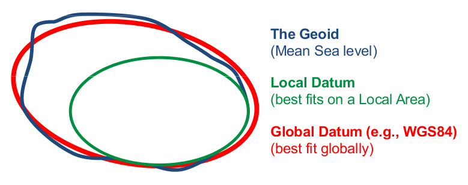

```{=html}
<style> 
p.comment {
background-color: #DBDBDB;
padding: 10px;
border: 1px solid black;
margin-left: 25px;
border-radius: 5px;
font-style: italic;
}

</style>
```
::: {.alert .alert-info}
<strong>NAME: </strong> *[write your name.surname between the brackets (like that name.surname)]*
:::

Welcome to this **Introduction to** *(geographic data with)* **R**.

In this practical exercise will start learning the `R` programming language. We will do so through building on our existing knowledge of geographic data models: **vector and raster**.

::: {.alert .alert-block .alert-success}
**The goal** of this `R` Notebook is to *prepare the groundwork* for the **Advanced Spatial Data Analysis** we will explore throughout the remainder of the term.

Our focus is **understanding concepts, the analysis, potential and application** of these methods.

This assignment is therefore an opportunity for you to reinforce the concepts **you are well of**. But do so in a ***new environment with a new programming language***.
:::

***We do not cover all the details of `R`.*** If you are unsure what the parameters for a particular function are or if you wish to explore other arguments related to a function, please consult the `help` files or the relevant package `vignette`.

In this assignment, you will work through the the following topics:

   **1. Fundamentals**\
      a. Vector data in R\
<!--         i. Basic map making\
         ii. the `sf` class\-->
      b. Raster data in R\
<!--         i. Basic map making\
         ii. Raster classes\-->
      c. Coordinate Reference Systems\
<!--         i. Geographic coordinate systems\
         ii. Projected coordinate systems\-->
   **2. Attribute data operations**\
      a. Manipulating Vector data\
      b. Raster data manipulation\
   **3. Spatial data operations**\
      a. Spatial operations on Vector data\
      b. Spatial operations on Raster data\
   **4. Reading, graphing and writing data**\

::: {.alert .alert-danger}
<strong>REQUIRED!</strong>

You are required to insert your outputs and any comment into this document. The document you submit should therefore contain the existing text in addition to:

-   Plots and other outputs from executing the code chunks
-   Discussion of your plots and other outputs as well as conclusions reached.
-   This should also include any hypotheses and assumptions made as well as factors that may affect your conclusions.
:::

```{r install }

#- https://bookdown.org/robinlovelace/geocompr/spatial-class.html

options(prompt="> ", continue="+ ", digits=3, width=70,  show.signif.stars=F, repr.plot.width=7, repr.plot.height=7), rm(list=ls())

# Install necessary packages: You only need to run this part once
install.packages(c("sf", "raster", "spData", "remotes", "ggplot2", "patchwork", "leaflet", "tidyverse" ))
remotes::install_github("Nowosad/spDataLarge")

library(sf)           # 'simple features' representations of spatial objects
library(raster)       # 
library(spData)
library(spDataLarge)
library(dplyr)
library(stringr) 
library(ggplot2)
library(patchwork)
library(leaflet) 
library(tidyverse)
```

::: {.alert .alert-warning}
<strong>QUESTION!</strong>
:::

- **Question 1.** What are the benefits of **Advanced Spatial Data Analysis** through a programming language like `R`?

    What value do you see; in this practical application of **Advanced Spatial Data Analysis** theory? Discuss your answer *(which cannot be more than 100 words)*

<p class="comment">
[ Click in this cell and write your answer here ]
</p>

## 1. Fundamentals

Lets start with the *absolute foundation* and recap spatial data models.

The ***vector*** **data model** represents the world using *points, lines and polygons*. These have *discrete, well-defined borders*, meaning that vector datasets usually have a high level of precision (but not necessarily accuracy).


The ***raster*** **data model** divides the surface up into cells of constant size. Raster datasets are the basis of background images used in web-mapping and have been a vital source of geographic data since the origins of aerial photography and satellite-based remote sensing devices. Rasters *aggregate* spatially specific features to a given resolution, meaning that they are consistent over space and scalable (many worldwide raster datasets are available).

## 1. a. Vector data in R

The vector data model is based on points located within a *coordinate reference system (CRS)*. Points can represent stand-alone features (e.g., the location of a bus stop) or they can be linked together to form more complex geometries such as lines and polygons.

Most point geometries contain only two dimensions (a 3-dimensional CRS contains an additional $z$ value, typically representing height above sea level).

We will introduce the point and as we advance; lines, polygons and more advanced geometry types *(multi-point, -line and -polygon)* will be explored.


In `R` we interogate vector data with the `sf` package; which provides a class system for geographic vector data.

```{r vig }
vignette(package = "sf") # see which vignettes are available
vignette("sf1")          # an introduction to the package
```

As you can see; its possible to explore how `R` functions through a `vignette` (a brief description). `vignette("sf1")` explains, simple feature (`sf`) objects in `R` are stored in a data.frame, with geographic data occupying a special column, usually named `geom` or `geometry`.

We will use the `world` dataset provided by the `spData`, loaded at the beginning of this chapter.

`world` is a spatial object containing spatial and attribute columns, the names of which are returned by the function `names()` (the last column `geom` contains the geographic information)

```{r names}
names(world)
```

As mentioned; the contents of the `geom` column give `sf` objects their spatial powers: that contains all the coordinates of the country polygons. 

The `sf` package provides a `plot()` method for quickly visualizing geographic data

```{r plot basic }
#- change the following line of code to answer the question
plot(world)
```

Note that instead of creating a single map, as most GIS programs would, the `plot()` command has created multiple maps, one for each variable in the `world` dataset. This behavior can be useful for exploring the spatial distribution of different variables.

::: {.alert .alert-warning}
<strong>TASK / QUESTION!</strong>
:::

-   **Question 2.** Notice the `Warning: plotting the first 9 out of 10 attributes; use max.plot = 10 to plot all`. Change the previous command to `plot()` **ALL** .

<p class="comment">
[ The previous plot should show 10 plots not 9 ]
</p>

**As you no doubt have worked with a `dataframe` from your Python experience**; being able to treat spatial objects as regular data frames with spatial powers has many advantages. The commonly used `summary()` function, for example, provides a useful overview of the variables within the world object.

```{r summary }
summary(world["lifeExp"])
#summary(world["geom"])
```


::: {.alert .alert-warning}
<strong> TASK / QUESTION!</strong>
:::

-   **Question 3.** Change the `code` chunk above to print the `summary()` of the geometry column. What does the output tell us about:  
       a. its geometry type?\
       b. The number of countries?\
       c. Its coordinate reference system (CRS)?.

<p class="comment">
[ The previous printout should show the summary of the `geometry` column **and** your answers must be filled in here:\
   a.\
   b.\
   c. ]
</p>

`sf` objects are easy to ***subset***. The `code` below _shows_ its first two rows and three columns. The output shows two major differences compared with a regular `data.frame`: the inclusion of additional geographic data *(geometry type, dimension, bbox and CRS information - epsg (SRID), proj4string)*, and the presence of a `geometry` column, here named `geom`. Notice the `geom` column was not selected ***(subset)*** but is shown.

```{r }
world_mini = world[1:2, 1:3]
world_mini
```

The preceding `code` chunk uses `=` to create a new object called `world_mini` in the command `world_mini = world[1:2, 1:3]`. This is called ***assignment***.

An equivalent command to achieve the same result is `world_mini <- world[1:2, 1:3]`. Although *'arrow assignment'* is more commonly used; which to use is largely a matter of preference as long as you're consistent!

#### - compatibility

`sf` is the most modern and recent `R` package for working with spatial data. ***Due to the nature of programming it will take many years for most packages to add support and some will never be compatible.*** Fortunately, these can still be used based on `sf` objects, by converting them. The example below converts an `sf` object to the older legacy Spatial class `sp` package.

```{r sf-convert }
library(sp)
world_sp = as(world, Class = "Spatial")
class(world_sp)
```

Spatial `sp` objects can be converted back to `sf` in the same way or with `st_as_sf()`.

```{r sp-convert }
world_sf = st_as_sf(world_sp)
class(world_sf)
```

### 1. a. i. Basic map making

As already introduced. Basic maps are created in `sf` with `plot()`. By default this creates a multi-panel plot, one sub-plot for each variable of the object, as illustrated in the bottom panel which plots the `pop` column from the `world` `sf`. 

The `code` chuck (block) executes both commands but represents the plots in separate tabs. Notice the Notebook (`html`) will plot each _one-below-the-other_ as the command is executed.

```{r basic-map }
plot(world[3:6])
plot(world["pop"])
```

We can add layers to existing images by setting `add = TRUE`.

For example, and to provide a taste of content we will cover later, we can perform a spatial operation and ***combine*** Asian countries and `add = True` the result to an existing `plot()`

```{r combine-asia}
 #- assign Asia to a new variable
world_asia = world[world$continent == "Asia", ]
#- union
asia = st_union(world_asia)
```

```{r plot-add }
#- plot the world
plot(world["pop"], reset = FALSE)
#- add asia on top of world
plot(asia, add = TRUE, col = "red")
```

::: {.alert .alert-warning}
<strong>TASK / QUESTION!</strong>
:::

-   **Question 4.** Change the previous ***two*** `code` chunks to `plot()` a *yellow* South America over the `world`.

<p class="comment">
[ The previous plot should show a yellow south america over the world ]
</p>

Alternately we could place a focus area in context. 

The following `code` snippet subsets `India` from `world` and draws our attention with `expandBB`. `expandBB` acts like a bounding box. It takes a numeric vector of length four that expands the bounding box of the plot relative to zero in the following order: _bottom, left, top, right_.

```{r plot-add-02 }
india = world[world$name_long == "India", ]
plot(st_geometry(india), expandBB = c(0, 0.2, 0.1, 1), col = "gray", lwd = 3)
plot(world_asia[0], add = TRUE)

#- add your code here


```

::: {.alert .alert-warning}
<strong> TASK / QUESTION!</strong>
:::

-   **Question 5.** Extend the `code` in the block above to show the name of the country at the center of the **bold** outline.

::: {.alert .alert-info}
<strong>HINT!: </strong> You will need to find the `column` the name is located in and the coordinates at the center of the polygon. Have a look at `st_centroid()`.
:::

<p class="comment">
[ The previous plot must show the word **'India'** in the center of **bold** outline ]
</p>

### 1. a. ii. The `sf` class

Thus far we have dealt with purely geometric objects, `geometry` and `column` objects. These are geographic building blocks of geographic vector data represented as simple features (`sf`). 

final building block is non-geographic *attributes*, representing the name of the feature or other attributes such as measured values, groups, and categories.

To illustrate attributes, we will represent a temperature of 25°C in Cape Town on June 21st, 2020. This example contains a geometry (the coordinates), and three attributes with three different classes (place name, temperature and date). Objects of class `sf` represent such data by combining the attributes (`data.frame`) with the simple feature geometry column (`sfc`).

**These concepts should seems familiar to you**. The `geopandas` package, which you have experience with, is the Python equivalent to `sf`.

```{r sf-class-create }
#- sfg object
lnd_point = st_point(c(18.423, -33.918))  
#- sfc object
lnd_geom = st_sfc(lnd_point, crs = 4326)   
#- data.frame object
lnd_attrib = data.frame(                           
  name = "Cape Town",
  temperature = 25,
  date = as.Date("2020-06-21")
  )

#- sf object
lnd_sf = st_sf(lnd_attrib, geometry = lnd_geom)    
lnd_sf
```

::: {.alert .alert-warning}
<strong> QUESTION!</strong>
:::

-   **Question 6.** Explain what the previous `code` chuck does.

::: {.alert .alert-info}
<strong>HINT!: </strong> You want to discuss the process from `geometry` to `column`, the `data.frame` and combining these to create a `sf`.
:::

<p class="comment">
[ Click in this cell and write your answer here ]
</p>

```{r lnd_sf-class }
class(lnd_sf)
```

Once again notice. The result shows that `sf` objects actually have two classes, `sf` and `data.frame`. Simple features are simply data frames (square tables), but with spatial attributes stored in a list column, usually called `geometry` of `geom`.

## 1. b. Raster data in R

The geographic raster data model usually consists of a matrix (with rows and columns) representing equally spaced cells. The raster header defines the CRS, the extent and the origin.

The origin (or starting point) is frequently the coordinate of the lower-left corner of the matrix (some packages however use the upper left corner). The cell of one raster layer can only hold a single value. The value can be either numeric or categorical


Raster maps usually represent ***continuous phenomena*** such as elevation, temperature, population density or spectral data. We can also represent discrete features *(**continuous phenomena**)* such as soil or land-cover classes with the help of a raster data model. _**Take care**_, the discrete borders can become blurred, and depending on the spatial task a vector representation might be more suitable.

We will explore raster data in `R` with the `raster` package. It provides an extensive set of functions to create, read, export, manipulate and process raster datasets.

```{r rast-vig }
help('raster')
```

For the illustration of raster concepts, we will use datasets from the `spDataLarge`. It consists of a few raster objects and one vector object covering an area of the [Zion National Park (Utah, USA)](https://en.wikipedia.org/wiki/Zion_National_Park). We will start with *'srtm.tif'*. A digital elevation model of the area.

```{r srtm }
raster_filepath = system.file("raster/srtm.tif", package = "spDataLarge")
new_raster = raster(raster_filepath)
new_raster
```

Similar to a vector dataset; simply printing the variable will report the dedicated functions for each component: `dim(new_raster)` returns the number of rows, columns and layers; the `ncell()` function the number of cells (pixels); `res()` the raster's spatial resolution; extent() its spatial extent; and `crs()`

### 1. b. i. Basic map making

Similar to the `sf` package, raster also provides `plot()` methods for its own classes.

```{r rast-plot }
plot(new_raster)
```

### 1. b. ii. Raster classes

```{r rast-class }
class(new_raster)
```

The `RasterLayer` class represents the simplest form of a raster object, and consists of only one layer. 

Alternately; a `RasterBrick` consists of multiple layers, which typically correspond to a single multispectral satellite image or a single multilayer object in memory. The `brick()` function creates a `RasterBrick` object.

```{r raster-brick }
multi_raster_file = system.file("raster/landsat.tif", package = "spDataLarge")
r_brick = brick(multi_raster_file)
r_brick
```

```{r brick-layers }
nlayers(r_brick)
```

```{r rast-brick-plot }
plot(r_brick$landsat_1)
```

::: {.alert .alert-warning}
<strong> QUESTION!</strong>
:::

-   **Question 7.** Change the `code` above to `plot()` the `landsat_3` layer.

<p class="comment">
[ The previous plot should show `landsat_3` not `landsat_1` ]
</p>

-   **Question 8.** What are the advantages of storing raster layers in the `RasterBrick` format?

<p class="comment">
[ Click in this cell and write your answer here ]
</p>

## 1. c. Coordinate Reference Systems

As you are well aware; a Coordinate Reference System (CRS), defines how the spatial elements of the data (`geometry`) relate to the surface of the Earth. A CRS are either geographic or projected and an easy way to remember the difference is: _a geographic crs is typically round while a projected crs is generally flat_.

### 1. c. i. Geographic coordinate systems

Geographic coordinate systems identify any location on the Earth's surface using two values --- longitude and latitude. In a geographic crs we typically represent the earths surface with an ellipsoid.

Ellipsoids are part of a wider component of a CRS: *the datum*. There are two types of datum --- local and geocentric. The datum contains information on what ellipsoid to use and the precise relationship between the Cartesian coordinates and location on the Earth's surface. These allow local variations in Earth's surface, for example due to large mountain ranges, to be accounted for in a local CRS.

***None of this should be new nor a surprise to you. You actually know this already.***



Consider the **Hartebeesthoek94** datum used with the local *South African Coordinate Reference* System. In the Hartebeesthoek94 datum; the ellipsoidal surface is ***shifted*** to align with the surface at the Hartebeesthoek Observatory; west of Pretoria.

In a geocentric datum such as **WGS84** the center is the Earth's center of gravity and the accuracy of projections is not optimized for a specific location.

A geographic crs is typically round, and records locations in angular units (usually degrees).

### 1. c. ii. Projected coordinate systems

***All projected CRS are based on a geographic CRS***, described in the previous section, ***and rely on map projections to convert the three-dimensional surface of the Earth into Easting and Northing (x and y) values in a projected CRS.*** i.e.: A projected CRS is based on Cartesian coordinates on a flat surface.

We will not dive into projections here but be aware; *no projection is distortion free*. It is not possible to represent the 3D earth on a 2D map and preserve distance and area measurements, shape and direction.

A projected crs is generally flat, and records locations in linear units (usually meters).

### 1. c. iii. CRS and `R`

Two main ways to describe CRS in `R` are an `epsg` code or a `proj4string` definition. Both of these approaches have advantages and disadvantages.

An `epsg` code is usually shorter, and therefore easier to remember. The code also refers to only one, well-defined coordinate reference system.

On the other hand, a `proj4string` definition allows you more flexibility when it comes to specifying different parameters such as the projection type, the datum and the ellipsoid.

In `sf` the CRS of an object can be retrieved using `st_crs()`. For this, we need to read-in a vector dataset

```{r st }
vector_filepath = system.file("vector/zion.gpkg", package = "spDataLarge")
new_vector = st_read(vector_filepath)
st_crs(new_vector)
```

In cases when a CRS is missing or the wrong CRS is set, the `st_set_crs()` function can be used.

```{r set-crs }
new_vector = st_set_crs(new_vector, 4326)
```

The warning message informs us that the `st_set_crs()` function does not transform data from one CRS to another. We have not **projected** the dataset to a new crs but merely **assigned** a crs.

The `projection()` function can be used to access CRS information from a `raster` object

```{r crs-raster }
projection(new_raster)
```

# 2. Attribute data operations

Attribute data is non-spatial data associated with geographic (`geometry`) data. 

A bus stop provides an example. Position would typically be represented by location: latitude and longitude coordinates (geometry data), in addition to its name. The name is an attribute of the feature that bears no relation to its geometry.

Another example is the elevation value (attribute) for a specific grid cell in raster data.

**The focus of this section is manipulating geographic objects based on attributes** such as the name of a bus stop and elevation. For vector data, this means operations such as *subsetting and aggregation*. These non-spatial operations have spatial equivalents. This is good news: skills developed here are cross-transferable, meaning that this section lays the foundation for the next, and extends the methods presented here to the spatial world.

Raster attribute data operations covers creating continuous and categorical raster layers and extracting cell values from one layer and multiple layers (raster subsetting).

## 2. a. Manipulating Vector data

The previous section introduced the `sf` class that extends a `data.frame` with a `geometry` column. `sf` provides methods that allow `sf` objects to behave like regular data frames.

```{r sf-methods }
methods(class = "sf") 
```

Lets use `[49] st_drop_geometry()`.

```{r drop_geom }
world_df = st_drop_geometry(world)
class(world_df)
```

::: {.alert .alert-warning}
<strong> QUESTION!</strong>
:::

-   **Question 7.** Describe what the previous `code` chunk did.

<p class="comment">
[ Click in this cell and write your answer here ]
</p>

We will introduce both base `R` and the `tidyverse` package `dplyr` for working with a `data.frame`.

### 2. a. - Vector attribute subsetting

Base `R` subsetting functions include `[`, `subset()` and `$`. The `dplyr` library subsetting functions include `select()`, `filter()`, and `pull()`. Both sets of functions preserve the spatial components of attribute data in `sf` objects

Lets remind ourselves what we have.

```{r sum_world }
summary(world)
```

The `[` operator can subset both rows and columns. 

You use indices to specify the elements you wish to extract from an object, e.g., `object[i, j]`, with `i` and `j` typically being numbers or logical vectors representing rows and columns *(they can also be character strings, indicating row or column names)*. Leaving `i` or `j` empty returns all rows or columns, so `world[1:5, ]` returns the first five rows and all columns. The examples below demonstrate subsetting with base `R`

```{r sub-base }
world[1:6, ] # subset rows by position
world[, 1:3] # subset columns by position
world[, c("name_long", "lifeExp")] # subset columns by name
```

A demonstration of the utility of using *logical vectors* for subsetting is shown in the `code` chunk below. This creates a new object, `small_countries`, containing nations whose surface area is smaller than 10,000 km2:

```{r sub-logical }
small_countries = world[world$area_km2 < 10000, ]
small_countries
```

#### 2. a. - `subset()`

The base `R` function `subset()` provides yet another way to achieve the same result:

```{r sub-subset-1 }
small_countries = subset(world, area_km2 < 10000)
small_countries
```

We now explore the `dplyr` subsetting functions: `select()`, `slice()`, `filter()` and `pull()`

#### 2. a. - `dplyr::select`

`dplyr::select` harvests columns by name or position. For example, you could select only two columns, `name_long` and `pop`, with the following command *(note the sticky `geom` column remains)*:

```{r sub-select-1 }
world1 = dplyr::select(world, name_long, pop)
names(world1)
```

`dplyr::select` also allows subsetting of a range of columns with the help of the `:` operator.

```{r sub-select-2 }
# all columns between name_long and pop (inclusive)
world2 = dplyr::select(world, name_long:pop)
world2
```

Omit specific columns with the `-` operator:

```{r sub-select-3 }
# all columns except subregion and area_km2 (inclusive)
world3 = dplyr::select(world, -subregion, -area_km2)
world3
```

Conveniently, `dplyr::select` lets you `subset` and `rename` columns at the ***same time***, for example:

```{r sub-select-4 }
world4 = dplyr::select(world, name_long, population = pop)
names(world4)
```

#### 2. a. - `pull()`

Most `dplyr` verbs return a `data.frame`. To extract a single vector, one has to explicitly use the `pull()` command.

```{r sub-pull-1 }
# create throw-away data frame
d = data.frame(pop = 1:10, area = 1:10)
# return data frame object when selecting a single column
class(d["pop"])
```

```{r sub-pull-2 }
# return data frame object when selecting a single column
class(select(d, pop))
```

```{r sub-pull-3 }
# return a vector when selecting a single column
class(d[, "pop"])
```

```{r sub-pull-4 }
class(pull(d, pop))
```

The reason `[()` returns also a `data.frame` is due to the sticky `geometry` column. `pull()` and `$` will give back a vector only.

```{r sub-pull-5 }
# data frame object
class(world[, "pop"])
# vector objects
class(world$pop)
class(pull(world, pop))
```

#### 2. a. - `slice()`

`slice()` is the row-equivalent of `select()`. The following code chunk, for example, selects the 3rd to 5th rows:

```{r slice }
slice(world, 3:5)
```

#### 2. a. - `filter()`

`filter()` is `dplyr` equivalent of base `R` `subset()` function. It keeps only rows matching given criteria, e.g., only countries with a very high average of life expectancy:

```{r filter }
# Countries with a life expectancy longer than 82 years
world6 = filter(world, lifeExp > 82)
world6
```

::: {.alert .alert-warning}
<strong> QUESTION!</strong>
:::

-   **Question 8.** What is the difference between `select()` and `filter()`?

<p class="comment">

[ Click in this cell and write your answer here ]

</p>

#### 2. a. - `%>%` operators

`dplyr` works well with the *'pipe' operator* `%>%`. It enables expressive code: ***the output of a previous function becomes the first argument of the next function***, enabling chaining. This is illustrated in the `code` chunk below, in which only countries from Asia are filtered from the `world` `sf`, next the object is `subset` by columns (`name_long` and `continent`) and the first five rows.

```{r pipe }
world7 = world %>%
  filter(continent == "Asia") %>%
  dplyr::select(name_long, continent) %>%
  slice(1:5)
world7
```

The `code` chunk above shows how the *pipe operator* allows commands to be written in a clear order: that run from top to bottom (line-by-line) and left to right. i.e.: take `world` `filter()` 'Asia', `select()` columns and `slice()` rows.

::: {.alert .alert-warning}
<strong> QUESTION!</strong>
:::

-   **Question 9.** Change the `code` chunk above to execute your own *pipe*. Change the continent to South America and the object name to `s_ameri`. Choose the `name_long`, `lifeExp`, `pop` columns only. Additionally change the name of the `pop` column to `population` and `slice` the last 7 rows only.

<p class="comment">

[ The printout of `s_ameri` above must show last 7 rows of the `name_long`, `lifeExp` and `population` columns ]

</p>

### 2. a. - Vector attribute aggregation

Aggregation operations summarize datasets by a *'grouping variable',* typically an ***attribute column***.

An example of ***attribute aggregation*** is calculating the number of people per continent based on country-level data (one row per country).

The `world` dataset contains the necessary ingredients: the columns `pop` and `continent`, the population and the grouping variable, respectively. The aim is to find the `sum()` of country populations for each continent. This can be done with the base `R` function `aggregate()` as follows:

```{r aggr }
world_agg1 = aggregate(pop ~ continent, FUN = sum, data = world, na.rm = TRUE)
class(world_agg1)
```

```{r show-aggr }
world_agg1
```

The result is a ***non-spatial data frame*** with six rows, one per continent, and two columns reporting the name and population of each continent. **NOTE:** We cannot `plot()` the previous result.

Alternately; the `aggregate()` method behaves differently when the input is an `sf` object **and** the `by` argument is provided

```{r aggr-sf }
world_agg2 = aggregate(world["pop"], by = list(world$continent),
                       FUN = sum, na.rm = TRUE)
class(world_agg2)
```

Notice the `sf` result. A `data.frame` and the `sf` (a geom (`sfg`) and column (`sfc`)). We can `plot()` this result.

```{r plot-aggr-sf }
plot(world_agg2['pop'])
```

`summarize()` is the `dplyr` equivalent of `aggregate()`.

```{r world-sum }
world %>% 
  summarize(pop = sum(pop, na.rm = TRUE), n = n())
```

We can see here that we have calculated the world population. In the previous `code` chunk `pop` and `n` are column names in the result. `sum()` and `n()` were the `aggregate()` functions. The result is an `sf` object with a single row representing the world.

Generally `summarize()` follows `group_by()`, which specifies the grouping variable, as illustrated below:

```{r summarize }
world_agg3 = world %>%
  group_by(continent) %>%
  summarize(pop = sum(pop, na.rm = TRUE))
world_agg3
```

::: {.alert .alert-warning}
<strong> QUESTION!</strong>
:::

-   **Question 11.** What is the difference between the `world_agg3` result from the `{r summarize }` `code` chuck, above, and the `world_agg1` result from `{r show-aggr }` previously? Discuss which you choose and why.

<p class="comment">

[ Click in this cell and write your answer here ]

</p>

To illustrate the power of a pipe lets execute an example.

Let's combine what we have learned so far about `dplyr` by chaining together functions to find the world's 3 most populous continents *(with `dplyr::top_n()`)* and the number of countries they contain. We can order the continents (rows) by decreasing population size for easier readability with `dplyr::arrange()`

```{r group-pipe }
world %>% 
  dplyr::select(pop, continent) %>% 
  group_by(continent) %>% 
  summarize(pop = sum(pop, na.rm = TRUE), n_countries = n()) %>% 
  top_n(n = 3, wt = pop) %>%
  arrange(desc(pop)) %>%
  st_drop_geometry()
```

::: {.alert .alert-warning}
<strong> QUESTION!</strong>
:::

-   **Question 11.** Change the previous `code` chunk to show the *4* ***countries*** with *the highest* **life expectancy** (`lifeExp`).

<p class="comment">

[ The printout of the previous `code` chuck must show a table with 2 columns (`name_long` and `lifeExp`) and 4 rows (countries with the highest life expectancy) ]

</p>

### 2. a. - Vector attribute joining

***All spatial analysis requires data preparation***. And one of the most common data preparation tasks is combining data from different sources. A `join` achieves this by combining tables based on a shared ***'key'*** variable. This section will focus on joining non-spatial datasets with `sf` objects *---we want to add a spatial component to tabular data.*

The result of a data `join` can be either an `sf` or `data.frame` object. The most common type of attribute `join` on spatial data takes an `sf` object as the first argument and adds columns to it from a `data.frame` specified as the second argument.

To demonstrate joins, we will combine data on coffee production with the `world` dataset. The coffee data is in a data frame called `coffee_data` from the `spData` package *(see ?coffee_data for details)*.

```{r coffee }
summary(coffee_data)
```

```{r print-coffee}
head(coffee_data, 8)
```

We can see; coffee_data has 3 columns: `name_long` names major coffee-producing nations and `coffee_production_2016` and `coffee_production_2017` contain estimated values for coffee production in units of 60-kg bags in each year.

The following `code` chuck executes a `left_join`, which preserves the first dataset: merges `world` with `coffee_data`

```{r coffee-join }
world_coffee = left_join(world, coffee_data) 
class(world_coffee)

#- write your code (Question 11) here and save the result into a world_coffee_rev object

```

Because the input datasets share a ***'key variable'*** (`name_long`) the `join` worked. The result is an `sf` object ***identical to the original world object but with two new variables*** (with column indices 12 and 13) on coffee production.

```{r coffee-names }
names(world_coffee)
```

::: {.alert .alert-warning}
<strong> TASK / QUESTION!</strong>
:::

-   **Question 11.** Change the previous `{r coffee-join }` `code` chunk to perform the `join` in the other direction: *starting with a non-spatial dataset and adding variables from a `sf` object*. Discuss the result and comment on which you would prefer and why.

<p class="comment">

[ Click in this cell and write your answer here ]

</p>

Since we added tabular data to an existing `sf` object we have a `geom` property; we can be `plot()` this.

```{r plot-coffee }
plot(world_coffee["coffee_production_2017"])
```

On many occasions your data will not have matching column names (nor be neat, tidy and clean). When column names do not match but the content does; we use the `by` argument.

```{r coffee-join-by }
#- change a column name
coffee_renamed = rename(coffee_data, nm = name_long)
#- join
world_coffee2 = left_join(world, coffee_renamed, by = c(name_long = "nm"))
```

You are welcome to check `world_coffee2`. It is identical to `world_coffee`.

An additional feature of the result is that it (`world_coffee`) has the same number of rows as the original dataset. There are only 47 rows of data in `coffee_data`, but all 177 country records are kept intact in `world_coffee` and `world_coffee2`.

```{r print-len }
print(nrow(world))
print(nrow(coffee_data))
print(' ')
print(nrow(world_coffee))
print(nrow(world_coffee2))
```

Lastly, and ***most importantly***, rows in the original dataset with no match are assigned `NA` values for the new `world_coffee` variables.

To illustrate this phenomenon; lets perform a different type of `join`.

An `inner_join` will match the ***content*** of the shared *'key variable'* (`name_long`) column.

```{r inner-join }
world_coffee_inner = inner_join(world, coffee_data)
#- print(' ')
print(nrow(world_coffee_inner))
```

Notice 2 **extremely vital points**:\
- `world_coffee_inner` only has 45 rows while the original `coffee_data` has 47.\
- `world_coffee_inner` only has 45 rows while the previous `join` result `world_coffee` has 177.

The best way to illustrate is to `plot()`

```{r inner-join-plot }
plot(world_coffee_inner['coffee_production_2017'])
```

While this makes sense; since only coffee producing countries are shown; **we still need to find out why** `world_coffee_inner` only has 45 rows while the the original tabular dataset (`coffee_data`) has 47.

To identify the rows that do not match use the `setdiff()` function as follows:

```{r set-diff}
setdiff(coffee_data$name_long, world$name_long)
```

The result shows that *"Others"* accounts for one row not present in the `world` dataset and that the name of the *"Democratic Republic of the Congo"'* accounts for the other: it has been abbreviated, causing the join to miss it.

The following command uses a string matching *(regex)* function from the `stringr` package to confirm what *"Congo, Dem. Rep of"* should be:

```{r dem-rep-con-proper-name }
str_subset(world$name_long, "Dem*.+Congo")
```

You can confirm this difference by scrolling up and looking at the result of `{r print-coffee}` above.

::: {.alert .alert-danger}
<strong>NOTE!</strong>

***What we have encountered here happens very often when combining datasets. Columns / fields might have the same name and refer to the same objects but their content (spelling) can differ.***

We need to change the name "Congo, Dem. Rep. of" in the `name_long` column of `coffee_data`
:::

```{r join-fix }
coffee_data$name_long[grepl("Congo,", coffee_data$name_long)] = 
  str_subset(world$name_long, "Dem*.+Congo")
world_coffee_match = inner_join(world, coffee_data)
nrow(world_coffee_match)
```

## 2. b. Manipulating rater objects

In contrast to the `sf` vector data model (which represents points, lines and polygons as discrete entities in space), raster data represent continuous surfaces. This section shows how raster objects work by creating them from *scratch*.

The following `code` creates raster dataset.

```{r elev }
elev = raster(nrows = 6, ncols = 6, res = 0.5,
              xmn = -1.5, xmx = 1.5, ymn = -1.5, ymx = 1.5,
              vals = 1:36)
plot(elev)
```

This demonstrates how the `raster()` function works to create an example raster named `elev` (representing elevations).

The result is a raster object with 6 rows and 6 columns (the `nrow` and `ncol` arguments), and a minimum and maximum spatial extent in x and y direction (`xmn`, `xmx`, `ymn`, `ymax`). The `vals` argument sets the values that each cell contains: numeric data ranging from 1 to 36 in this case.

Raster objects can also contain categorical values of class `logical` or `factor` variables in `R`. The following code creates a raster representing grain sizes.

```{r cat }
grain_order = c("clay", "silt", "sand")
grain_char = sample(grain_order, 36, replace = TRUE)
grain_fact = factor(grain_char, levels = grain_order)
grain = raster(nrows = 6, ncols = 6, res = 0.5, 
               xmn = -1.5, xmx = 1.5, ymn = -1.5, ymx = 1.5,
               vals = grain_fact)
plot(grain, col = rainbow(3), alpha = 0.6, legend = FALSE)
legend("topright", legend = c("clay", "silt", "sand"), fill = rev(rainbow(3)))
```

`raster` objects represent categorical variables as integers, so `grain[1, 1]` returns a number that represents a unique identifier, rather than "clay," "silt" or "sand." The raster object stores the corresponding look-up table or "Raster Attribute Table" (RAT) as a data frame in a new slot named `attributes`

Use the function levels() for retrieving and adding new factor levels to the attribute table:

```{r rast-cat-levels }
levels(grain)[[1]] = cbind(levels(grain)[[1]], wetness = c("wet", "moist", "dry"))
levels(grain)
```

This behavior demonstrates that raster cells can only possess one value, an identifier which can be used to look up the attributes in the corresponding attribute table. The command below, which returns the grain size and wetness of cell IDs 1, 11 and 35:

```{r return-cat }
factorValues(grain, grain[c(1, 11, 35)])
```

::: {.alert .alert-warning}
<strong> TASK / QUESTION!</strong>
:::

-   **Question 12.** Is it possibly to combine a numerical and categorical raster? How and why would you want too?

<p class="comment">

[ Click in this cell and write your answer here ]

</p>

### 2. b. - Raster subsetting

Non-spatial (attribute) `raster` subsetting is done with the base `R` operator `[`, which accepts a variety of inputs:

-   Row-column indexing\
-   Cell IDs

both return the value of the top left pixel in the raster object `elev`

```{r raster-subset }
#- row 1, column 1
elev[1, 1]
#- cell ID 1
elev[1]
```

Cell values can be modified by overwriting existing values in conjunction with a subsetting operation. The following code chunk, for example, sets the upper left pixel of `elev` to `0`:

```{r raster-replace }
elev[1, 1] = 0
elev[]
```

## 3. Spatial data operations

Spatial operations refer to how, vector and raster, objects can be modified based on their ***location and shape***.

While spatial operations have a non-spatial equivalent (attribute manipulation from the previous section) they do differ. The most important being; the ***type of spatial relationship between objects must be considered***. Do the objects touch, cross, intersect, etc.?

Spatial operations then require an understanding of topological relationships. **You are expected to possess this knowledge. We do not revise these concepts here.**

::: {.alert .alert-danger}
<strong>NOTE!</strong>

Spatial operations rely on objects having the same coordinate reference system.
:::

## 3. a. Spatial operations on vector data

This section provides an overview of spatial operations on vector geographic data represented as simple features in the `sf` package. We do not cover the entire range of function but highlight the most significant.

## 3. a. - Spatial subsetting

Spatial subsetting is the process of selecting features of a spatial object based on ***whether or not they relate in space to another object***. It is comparable to attribute subsetting and can be done with the base `R` square bracket (`[`) operator or with the `filter()` function from the `tidyverse`.

```{r nz-subset }
canterbury = nz |> filter(Name == "Canterbury")
class(canterbury)
canterbury_height = nz_height[canterbury, ]
```

```{r gg-nz-subset }

p1 <- ggplot(nz) +  ggtitle("High points in New Zealand") +
  geom_sf(color = "gray", fill = "white") +
  geom_sf(data = nz_height, color = "red", shape = 2) +
  coord_sf(datum = NA) +
  theme(panel.background = element_rect(fill = "lightblue", colour = "lightblue"),
        panel.border = element_rect(
    fill = alpha("#2C77BF", .1), color = alpha("#2C77BF", .5), linewidth = 2))

p2 <- ggplot(nz) + 
  geom_sf(color = "gray", fill = "white") +
  ggtitle("High points in Canterbury") +
  geom_sf(data = canterbury, color = "gray", fill = "gray") +
  geom_sf(data = canterbury_height, color = "red", shape = 2) +
  coord_sf(datum = NA) +
  theme(panel.background = element_rect(fill = "lightblue", colour = "lightblue"),
        panel.border = element_rect(
    fill = alpha("#2C77BF", .1), color = alpha("#2C77BF", .5), linewidth = 2))

p1 + p2
```

Notice; like attribute subsetting `x[y, ]` subsets features of a target `x` using the contents of a source object `y`. Instead of `y` being of class logical or integer (`True` / `False` or number); for spatial subsetting it is another spatial (`sf`) object.

Various topological relations can be used for spatial subsetting. These determine the ***type of spatial relationship that features in the target object*** must have with the subsetting object to be selected, including *touches, crosses or within*. `intersect` is the default spatial subsetting operator, a default that returns `TRUE` for many types of spatial relations, including `touches`, `crosses` and `is within`. These alternative spatial operators can be specified with the `op =` argument, a third argument that can be passed to the `[` operator for `sf` objects.

This is demonstrated in the following command which returns the opposite of `st_intersects()`, points that do *not intersect* with Canterbury:

```{r gg-nz-subset-op }

p1 <- ggplot(nz) +  ggtitle("High points in New Zealand") +
  geom_sf(color = "gray", fill = "white") +
  geom_sf(data = nz_height, color = "red", shape = 2) +
  coord_sf(datum = NA) +
  theme(panel.background = element_rect(fill = "lightblue", colour = "lightblue"),
        panel.border = element_rect(
    fill = alpha("#2C77BF", .1), color = alpha("#2C77BF", .5), linewidth = 2))

p2 <- ggplot(nz) + 
  geom_sf(color = "gray", fill = "white") +
  ggtitle("High points with no connection to\n Canterbury") +
  geom_sf(data = canterbury, color = "gray", fill = "gray") +
  geom_sf(data = op_can_height, color = "red", shape = 2) +
  coord_sf(datum = NA) +
  theme(panel.background = element_rect(fill = "lightblue", colour = "lightblue"),
        panel.border = element_rect(
    fill = alpha("#2C77BF", .1), color = alpha("#2C77BF", .5), linewidth = 2))

p1 + p2
```

## 3. a. - Spatial joining

As we already saw with an attribute join; joining two non-spatial datasets relies on a shared *'key'* variable. Spatial data joining applies the same concept, but instead relies on ***shared areas of geographic space***.

The process can best be illustrated by an example. Imagine you have ten points randomly distributed across the Earth's surface. Of the points that are on land, which countries are they in?

Random points to demonstrate spatial joining are created as follows:

```{r 04-spatial-operations-19}
set.seed(2018) # set seed for reproducibility
(bb = st_bbox(world)) # the world's bounds
random_df = data.frame(
  x = runif(n = 10, min = bb[1], max = bb[3]),
  y = runif(n = 10, min = bb[2], max = bb[4])
)
random_points = random_df |> 
  st_as_sf(coords = c("x", "y"), crs = "EPSG:4326") # set coordinates and CRS
```

```{r gg-spatial-plot }
p1 <- ggplot(world) +  #ggtitle("High points in New Zealand") +
  geom_sf(color = "gray", fill = "white") +
  geom_sf(data = random_points, color = "black", shape = 4, lwd = 7) +
  coord_sf(datum = NA) 
p1
```

The random_points object has no attribute data, while the `world` does. The spatial join operation is done by `st_join()`, which adds the `name_long` variable to the points, resulting in `random_joined`.

Before creating the joined dataset, we use spatial subsetting to create `world_random`, which contains only countries that contain random points, to verify the number of country names returned in the joined dataset should be four.

```{r 04-spatial-operations-20 }
world_random = world[random_points, ]
nrow(world_random)
random_joined = st_join(random_points, world["name_long"])
```

```{r gg-spatial-plot02, echo=FALSE }
# summary(random_joined$name_long) # factors still there
random_joined$name_long = as.character(random_joined$name_long)

p1 <- ggplot(world) +
  geom_sf(color = "gray", fill = "white") +
  # Map on the color aes
  geom_sf(data = random_joined, aes(color = name_long), shape = 16) + 
  coord_sf(datum = NA)

p1
```

::: {.alert .alert-warning}
<strong> TASK / QUESTION!</strong>
:::

-   **Question 13.** Discuss the **3. a. - Spatial joining** process we have just executed. Your answer must discuss how an attribute (`name_long`) was attached to the `random_points` dataset.

<p class="comment">

[ Click in this cell and write your answer here ]

</p>

## 3. a. - Non-overlaping joins

Sometimes two geographic datasets do **not touch** but still have a *strong geographic relationship* enabling joins. The datasets `cycle_hire` and `cycle_hire_osm`, already attached in the `spData` package, provide a good example.

```{r cycle_hire }
cycle_hire
```

```{r cycle_hire_osm }
cycle_hire_osm
```

Plotting them shows that they are often *closely related but they do not touch*.

Here we showcase the datasets with a fancy an interactive `leaftlet` plot. 

```{r interactive-cycle }

cp1 <- leaflet() %>%
	addTiles() %>%
	addCircleMarkers(data = cycle_hire,
			 popup = ~name,
			 col = 'red',
			 stroke = FALSE, fillOpacity = 0.3, opacity = 0.3) %>%
	addCircleMarkers(data = cycle_hire_osm,
			 popup = ~name,
			 color = 'blue', radius = 7, stroke = FALSE,
			 opacity = 0.50, fillOpacity = 0.50) %>%
  addLegend(colors = c("red"), labels = c("cycle_hire"))  %>%
  addLegend(colors = c("blue"), labels = c("cycle_hire_osm"))

cp1
```

```{r intersects }
any(st_touches(cycle_hire, cycle_hire_osm, sparse = FALSE))
```

Imagine that we need to join the `capacity` variable in `cycle_hire_osm` onto the official *'target'* data contained in `cycle_hire`. This is when a non-overlapping join is needed. The simplest method is to use the`st_is_within_distance()` operator; using a threshold distance of `20 m`.

Note that, before performing the relation, both objects are transformed into a projected CRS

```{r cycle-crs }
cycle_hire_P = st_transform(cycle_hire, 27700)
cycle_hire_osm_P = st_transform(cycle_hire_osm, 27700)
sel = st_is_within_distance(cycle_hire_P, cycle_hire_osm_P, dist = 20)
summary(lengths(sel) > 0)
```

::: {.alert .alert-warning}
<strong> QUESTION!</strong>
:::

-   **Question 14.** Why is it necessary to transform the dataset to a _projected_ `crs`? Why do we not normally perform a spatial join (an `st_join`) with a _geographic_ `crs` (like wgs84)?

<p class="comment">
[ Click in this cell and write your answer here ]
</p>

```{r cycle-join }
z = st_join(cycle_hire_P, cycle_hire_osm_P,
            join = st_is_within_distance, dist = 20)
nrow(cycle_hire)

nrow(z)
```

Note that the number of rows in the joined result is greater than the target. This is because some cycle hire stations in `cycle_hire_P` have multiple matches in `cycle_hire_osm_P`.

To `aggregate` the values for the overlapping points and return the `mean`, we can use the aggregation methods; which result in an object with the same number of rows as the target.

```{r cycle-agg-mean }
z = z %>% 
  group_by(id) %>% 
  summarize(capacity = mean(capacity))
nrow(z) == nrow(cycle_hire)
```

```{r interactive-cycle-01 }

zP = st_transform(z, 4326)

cp1 <- leaflet() %>%
	addTiles() %>%
	addCircleMarkers(data = zP,
			 popup = ~capacity,
  		 col = 'red',
			 stroke = FALSE, fillOpacity = 0.3, opacity = 0.3) %>%
	addCircleMarkers(data = cycle_hire,
			 popup = ~name,
			 color = 'blue', radius = 7, stroke = FALSE,
			 opacity = 0.50, fillOpacity = 0.50) %>%
  addLegend(colors = c("red"), labels = c("z"))  %>%
  addLegend(colors = c("blue"), labels = c("cycle_hire"))

cp1
```

## 3. b. Spatial operations on raster data

This section builds on Section 2. b, which introduces basic methods for manipulating raster datasets, to demonstrate more advanced and explicitly spatial raster operations, and uses the same `elev` and `grain` objects. For the reader's convenience, these datasets can be also found in the `spData` package.

## 3. b. - raster subsetting

The previous Section 2. b demonstrated how to retrieve values associated with specific cell `ID`s or `row` and `column` combinations. Raster objects can also be extracted by location (coordinates) and other spatial objects.

To use coordinates for subsetting, one can *'translate'* the coordinates into a cell `ID` with the raster function `cellFromXY()`. An alternative is to use `raster::extract()` (**be careful**, there is also a function called `extract()` in the `tidyverse` to extract values. Both methods are demonstrated below to find the value of the cell that covers a point located 0.1 units from the origin.

```{r retrieve-rast-val }
id = cellFromXY(elev, xy = c(0.1, 0.1))
elev[id]
# the same as
raster::extract(elev, data.frame(x = 0.1, y = 0.1))
```

It is convenient that both functions also accept objects of class `Spatial* Objects`. Raster objects can also be subset with another raster object and demonstrated in the `code` chunk below:

```{r raster-subset-raster }
clip = raster(xmn = 0.9, xmx = 1.8, ymn = -0.45, ymx = 0.45,
              res = 0.3, vals = rep(1, 9))
elev[clip]
```

So far, the subsetting returned the values of specific cells, however, when doing spatial subsetting, one often also expects a spatial object as an output. We want a raster we can `plot()` and see.

To do this, we can use again the `[` when we additionally set the drop parameter to `FALSE`. To illustrate this, we retrieve the first two cells of `elev` as an individual raster object. As mentioned the `[` operator accepts various inputs to subset rasters and returns a raster object when `drop = FALSE`.

The `code` chunk below subsets the `elev` raster by cell `ID` and row-column index with identical results: the first two cells on the top row (only the first 2 lines of the output is shown):

```{r spatial-subset }
elev[1:2, drop = FALSE]    # spatial subsetting with cell IDs
elev[1, 1:2, drop = FALSE] # spatial subsetting by row,column indices
```

## 3. b. - Map algebra

Map algebra makes raster processing really fast. This is because for the processing, the geographic position of a cell *(the location)* is barely relevant as long as we make sure that the cell position is still the same after the processing (one-to-one locational correspondence).

Additionally, if two or more raster datasets share the same extent, projection and resolution, one could treat them as matrices for the processing. This is exactly what map algebra is doing in `R`.

First, the raster package checks the headers of the rasters on which to perform any algebraic operation, and only if they are *correspondent to each other*, the processing continues.

And secondly, map algebra retains the so-called *one-to-one pixel* correspondence. This is where it substantially differs from matrix algebra which changes positions when for example multiplying or dividing matrices.

::: {.alert .alert-block .alert-success}
**You should be familiar with Map algebra.**

These concepts are the programmetric equivalent to the knowledge you have gained in **Geomatics III. APG 3012S. Remote Sensing.**
:::

Map algebra (or cartographic modeling) divides raster operations into four subclasses, with each working on one or several grids simultaneously:

i)  **Local or *per-cell* operations**.\
ii) **Focal or *neighborhood* operations**. Most often the output cell value is the result of a 3 x 3 input cell block.\
iii) **Zonal operations** are similar to focal operations, but the surrounding pixel grid on which new values are computed can have irregular sizes and shapes.\
iv) **Global or *per-raster* operations**; that means the output cell derives its value potentially from one or several entire rasters.

This typology classifies map algebra operations by the number/shape of cells used for each pixel processing step. For the sake of completeness, we should mention that raster operations can also be classified by discipline such as *terrain, hydrological analysis or image classification*.

**- Local operations**

Raster algebra is a classic use case of local operations. This includes adding, subtracting and squaring two rasters. Raster algebra also allows logical operations such as finding all raster cells that are greater than a specific value (5 in our example below).

```{r raster-algebra }
elev + elev
elev^2
log(elev)
elev > 5
```

**- Focal operations**

While **local functions** operate on *one cell*, though possibly from multiple layers, **focal operations** take into account a *central cell and its neighbors*. The neighborhood (also named kernel, filter or moving window) under consideration is typically of size 3-by-3 cells (that is the central cell and its eight surrounding neighbors), but can take on any other (not necessarily rectangular) shape as defined by the user.

A focal operation applies an *aggregation function* to all cells within the specified neighborhood, uses the corresponding output as the new value for the the central cell, and moves on to the next central cell.

Other names for this operation are ***spatial filtering and convolution***.

In `R`, we can use the `focal()` function to perform spatial filtering. We define the shape of the moving window with a matrix whose values correspond to weights (see w parameter in the code chunk below). Secondly, the `fun=` parameter lets us specify the function we wish to apply to this neighborhood. Here, we choose the minimum, but any other summary function, including `sum()`, `mean()`, or `var()` can be used.

```{r }
r_focal = focal(elev, w = matrix(1, nrow = 3, ncol = 3), fun = min)
r_focal
```

```{r raster-subset-spatial }
# Plot the raster objects side by side
par(mfrow = c(1, 2))
plot(elev, main = "Original")
plot(r_focal, main = "spatial filtering / Convolution")
```

Focal functions or filters play a dominant role in image processing. *Low-pass or smoothing filters* use the mean function to remove extremes. In the case of categorical data, we can *replace* the mean with the mode, which is the most common value. By contrast, *high-pass filters* accentuate features. Here the line detection *Laplace and Sobel filters* might serve as an example.

Terrain processing, the calculation of topographic characteristics such as slope, aspect and flow directions, relies on **focal functions**.

**- Zonal operations**

Just like *focal operations*, **zonal operations** apply an aggregation function to multiple raster cells. However, a second raster, usually a categorical raster, defines the zonal filters (or 'zones') in the case of zonal operations as opposed to a predefined neighborhood window in the case of focal operations.

This means, the raster cells defining the zonal filter do not necessarily have to be neighbors.

Our grain size raster, from earlier, is a good example because the different grain sizes are spread in an irregular fashion throughout the raster.

Finally, the result of a zonal operation is a summary table grouped by zone which is why this operation is also known as *zonal statistics*. This is in contrast to focal operations which return a raster object.

For example, to find the `mean` elevation for each grain size class, we use the `zonal()` function.

```{r zonal }
z = zonal(elev, grain, fun = "mean") %>%
  as.data.frame()
z
```

**- Global operations**

Global operations are a special case of zonal operations with the entire raster dataset representing a single zone. These are advanced functions and are mentioned here only.

The most common **global operations** are descriptive statistics for the entire raster dataset such as the minimum or maximum.

Aside from that, **global operations** are also useful for the computation of distance and weight rasters. In the first case, one can calculate the distance from each cell to a specific target cell.

For example, one might want to compute the distance to the nearest coast. We might also want to consider topography, that means, we are not only interested in the pure distance but would like also to avoid the crossing of mountain ranges when going to the coast. To do so, we can weight the distance with elevation so that each additional meter (height) *'prolongs'* the Euclidean distance.

::: {.alert .alert-warning}
<strong> QUESTION!</strong>
:::

-   **Question 14.** We have introduced two examples of global operations; where the topography is taken into consideration in a distance calculation. Give two other global operations examples.

<p class="comment">
[ Click in this cell and write your answer here *-ans: Visibility and viewshed*]
</p>

# 4. Reading, manipulating and graphing data

We conclude this exercise by reading a dataset from file, executing a few more examples of attribute data operations and graphing the result.

The dataset we are using are [chocolate bar ratings](https://www.kaggle.com/datasets/evangower/chocolate-bar-ratings) available via the Open Database License (ODbL); intended to allow users to freely share, modify, and use while maintaining the same freedom for others. 

```{r read-csv }
chocolateData <- read_csv("./data/chocolate_bars.csv", show_col_types = FALSE)
class(chocolateData)
```
We see our dataset became a `data.frame` via the `read_csv` function.

```{r rename }
#names(chocolateData) <- make.names(names(chocolateData), unique=TRUE)
head(chocolateData, 3)
```

```{r tail }
tail(chocolateData, 3)
```

Some of our column names have spaces in them. The following `code` chunk changes the column names to versions without spaces, which let's us talk about the columns by their names.

```{r clean }
# remove the first line of our dataset using a negative index
chocolateData <- chocolateData[-1,] 

# remove the white spaces in the column names
#names(chocolateData) <- gsub("[[:space:]+]", "_", names(chocolateData))

# remove percentage signs in the Cocoa_Percent 
chocolateData$cocoa_percent <- sapply(chocolateData$cocoa_percent, function(x) gsub("%", "", x))
head(chocolateData, 3)
```

Lets gain a deeper understanding of `ggplot2` functionality. 

Plots in `ggplot2` are _"built up"_ using multiple functions connected with the plus sign (`+`). The first function, `ggplot()`, just draws the outline of the plot, including the the axes and tick marks. It takes two arguments.

a. The dataset that you want to plot.
b. A function, `aes()`, short for aesthetic. This function itself takes multiple arguments. Let's start by using `x` & `y`, which will tell the function which columns of the `data.frame` to plot on the x axis and y axis.

Lets plot the data we have.

```{r plot-blank }
# draw a blank plot with "Review_Date" as the x axis and "Rating" as the y axis.
ggplot(chocolateData, aes(x= year_reviewed, y = rating))
```

As you can see, the `ggplot()` function doesn't actually plot anything. To actually plot something, we need to add a `geom` layer to our plot. There are lots of different `geom` layers and you can _add multiple layers to the same plot_.

For now, let's start by adding points to our plot, one for each data point. You may know this as a _"scatter plot"_.

```{r choc-plot }
# draw a plot with "Review_Date" as the x axis and "Rating" as the y axis, and add a point for each data point
ggplot(chocolateData, aes(x= year_reviewed, y = rating)) + geom_point()
```
This dataset has many over lapping points. To handle overplotting we can add a small amount to random noise to the dataset with `geom_jitter()`

```{r choc-plot-jitter }
#- jitter 
ggplot(chocolateData, aes(x= year_reviewed, y = rating)) + geom_point() + geom_jitter()
```

We can now see that there seem to be more reviews each year, and that they seem to be getting more tightly clustered.

Intuitively we can also see the reviews are getting more positive over time. 

But how certain can we be?

One way to check; is to fit a linear model to this data and see if it goes up or down over time. Using `ggplot2`, this is very easy to do! We can add a layer that will fit a linear model to this dataset and then plot it. 


```{r choc-plot-lm }
#- 
ggplot(chocolateData, aes(x= year_reviewed, y = rating)) + #, color = cocoa_percent)) + 
    geom_point() + 
    geom_jitter() +
    geom_smooth(method = 'lm')
```

We previously introduced to pipes (`%>%`) and how we could use them to group and summarize data. 

As an example: here we pipe a dataset into the `group_by()` function and tell it the name of a specific column, then it will look at all the values in that column and group together all the rows that have the same value in a given column. Therafter we pipe _**that data**_ into the `summarise()` function, and return the values; for each group separately

```{r choc-summarise }
# Return the average and sd of ratings by the year a rating was given
chocolateData %>%
    group_by(year_reviewed) %>%
    summarise(averageRating = mean(rating),
             sdRating = sd(rating))
```

Similarly we can then plot these summarized datasets, which may give us a better idea of trends than plotting the entire dataset.

```{r }
# Return the average and sd of ratings by the year a rating was given
averageRatingByYear <- chocolateData %>%
    group_by(year_reviewed) %>%
    summarise(averageRating = mean(rating))

# plot only the average rating by year
ggplot(averageRatingByYear, aes(y= averageRating, x = year_reviewed )) + 
    geom_point() + # plot individual points
    geom_line() # plot line
```
::: {.alert .alert-warning}
<strong> QUESTION!</strong>
:::

-   **Question 15.** Explain what the previous `code` chunk did.

<p class="comment">
[ Click in this cell and write your answer here ]
</p>

Finally we can save any object. Here we save the previous graph as a `.png`

```{r save }
# save our plot
ggsave("chocolateRatingByReviewDate.png", # the name of the file where it will be save
       height=6, width=10, units="in") # the size of the plot & units of the size
```

::: {.alert .alert-warning}
<strong> QUESTION!</strong>
:::

-   **Question 15.** Discuss the advantages and disdvantages of open licensing within the context of Spatial Data Science. _Your answer cannot be more than 100 words_.

<p class="comment">
[ Click in this cell and write your answer here *-ans: Visibility and viewshed*]
</p>

------------------------------------------------------------------------

<p class="comment">
**Image credit**\
- vector and raster: <https://geohackweek.github.io/himat-data/01-dataTypes/>\
- vector: <https://geobgu.xyz/r-2021/vector-layers.html>\
- raster: <https://bookdown.org/robinlovelace/geocompr/spatial-class.html#crs-in-r>  
- datum: <https://gssc.esa.int/navipedia/index.php?title=File:Datum.png>
</p>
